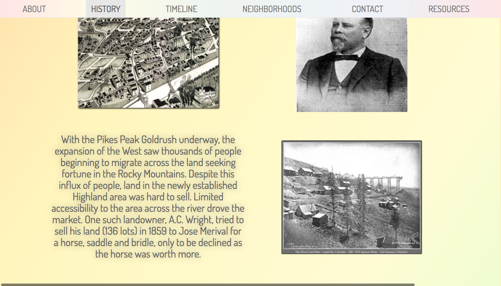
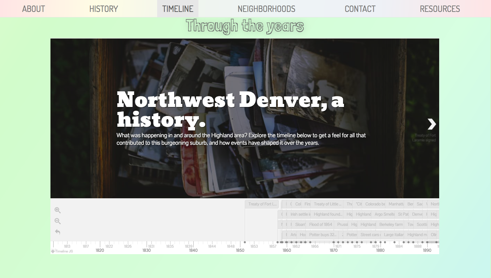
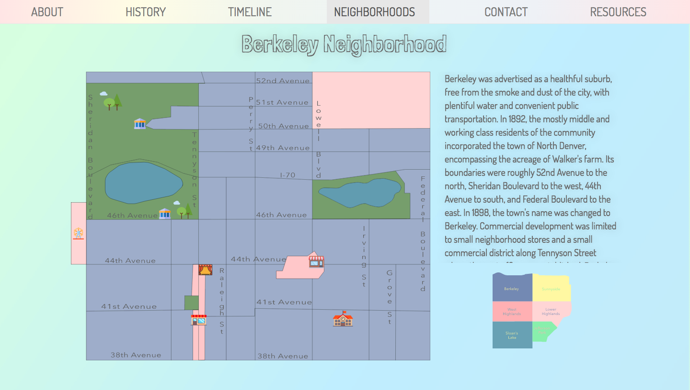
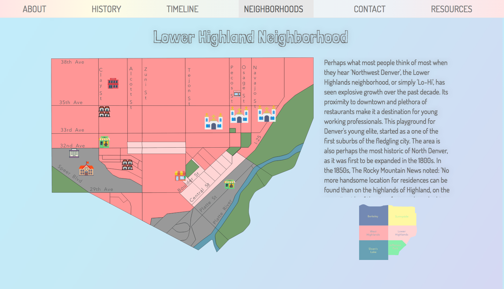
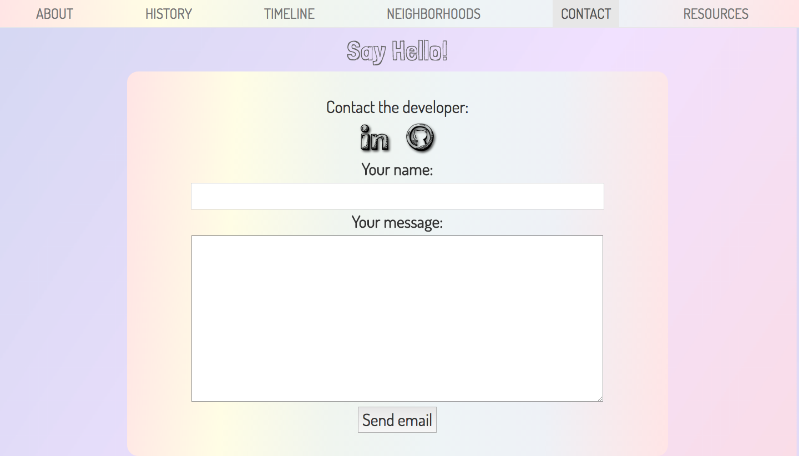
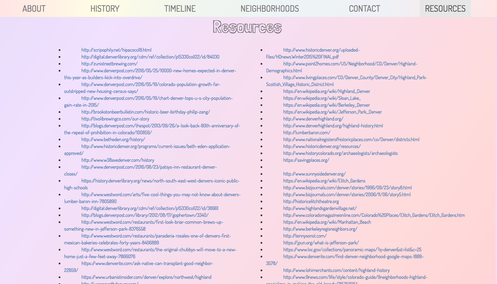

# Denver_Northwest
Facilitates the exploration of the the North West Denver area through interactive SVG maps and animation-heavy story-telling. Users are taken on a 'journey' through time and place to different historical landmarks and areas of import and are introduced to the constantly changing demographics of this dynamic area in Colorado's Capital.

[View the Northwest Denver interactive app here.]
(https://denvernorthwest.herokuapp.com/)

